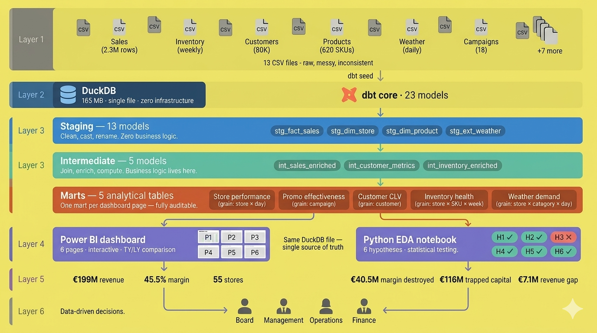
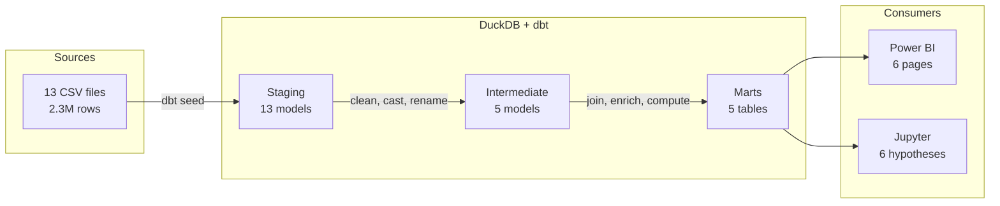

# Project Hoogland: Commercial Performance Diagnostic

**An end-to-end data analytics engagement for a Dutch outdoor retailer: from raw transactional data to a governed analytics warehouse, a six-page management dashboard, and a hypothesis-driven statistical analysis - with every finding quantified in euros.**

<p align="center">
  
  
  
  
  
</p>

---

## Business Context

Hoogland is a fictional Dutch outdoor retailer modelled on the A.S.Advanture/ Decathlon archetype. 55 stores across the Netherlands, €379M net revenue for two fiscal years, 80K loyalty members, 620 SKUs, and two years of transactional data (2024–2025).

The problem is not the topline, it's what's hiding underneath it. Revenue has grown year on year, but management treats that growth as proof of health. It isn't. Beneath the surface, three structural issues are compounding unchecked:
Margin leakage without accountability. The promotional calendar runs continuously: uitverkoop, Black Friday, seasonal campaigns - but nobody measures whether these promotions create net value or simply shift demand forward at a lower margin. Revenue goes up; profitability goes down. The business celebrates the first number and ignores the second.

Capital trapped in the wrong places. The product catalogue has expanded over time, but nobody has asked which SKUs actually earn their shelf space. Slow-moving inventory accumulates across 55 stores, tying up working capital that could be reinvested in proven performers. Meanwhile, high-performing stores are under-allocated relative to their potential, while underperformers consume disproportionate resources. No diagnostic infrastructure. Data sits in disconnected CSV files such as sales, inventory, customers, weather, campaigns - with no governed warehouse connecting them. There is no single source of truth. Leadership decisions are based on topline revenue reports and gut feel, because nobody has built the analytical layer that answers: Which promotion actually made money? Which store deserves more investment? Where is capital being wasted?

This project was built to close that gap: a governed data warehouse, an interactive BI layer, and a statistically validated hypothesis portfolio that quantifies every finding in euros.

---

## Key Findings

| # | Hypothesis | Method | Verdict | Business Impact |
|---|-----------|--------|---------|-----------------|
| H1 | Promo ROI illusion | Difference-in-Differences | **Confirmed** | **€40.5M** margin destroyed |
| H2 | Store allocation variance | Revenue-per-sqm analysis | **Confirmed** | **€7.1M** revenue gap |
| H3 | Channel cannibalization | Pearson correlation | **Rejected** | r = 0.995 - channels are complementary |
| H4 | Weather-demand coupling | OLS regression | **Confirmed** | **€1.7M** net weather exposure |
| H5 | Loyalty asymmetry | RFM / CLV segmentation | **Confirmed** | **17.2×** CLV gap between tiers |
| H6 | Pareto SKU concentration | Concentration analysis | **Confirmed** | **€116M** trapped in long-tail inventory |

**Total addressable value:** €53.6M margin uplift + €116M working capital release.

---

## Architecture

The project follows a three-layer **dbt** architecture inside a single-file **DuckDB** warehouse (165 MB, zero infrastructure). Each layer has a clear contract: staging cleans, intermediate enriches, marts aggregate to business grain.

<p align="center">
  
</p>

<p align="center"><em>End-to-end pipeline: 13 raw CSVs → DuckDB → 23 dbt models → 5 analytical marts → Power BI + Python</em></p>



### dbt Model Inventory

| Layer | Count | Role | Example |
|-------|-------|------|---------|
| Staging | 13 | Clean, cast, rename. Zero business logic. | `stg_fact_sales`, `stg_dim_store`, `stg_ext_weather_daily` |
| Intermediate | 5 | Join, enrich, compute. Business logic lives here. | `int_sales_enriched`, `int_customer_metrics`, `int_inventory_enriched` |
| Marts | 5 | One analytical table per business question. | `mart_store_performance`, `mart_promo_effectiveness`, `mart_customer_clv` |

### Five Marts and Their Grains

| Mart | Grain | Primary Consumer | Key Measures |
|------|-------|-----------------|--------------|
| `mart_store_performance` | store × day | Dashboard P1 + P2 | Revenue, margin, basket, transactions, rev/sqm |
| `mart_promo_effectiveness` | campaign | Dashboard P3 | Discount depth, margin impact, units lifted |
| `mart_customer_clv` | customer | Dashboard P4 | CLV, RFM scores, tenure, recency |
| `mart_inventory_health` | store × SKU × week | Dashboard P5 | Weeks of cover, stockout flag, est. lost revenue |
| `mart_weather_demand` | store × category × day | Dashboard P6 | Temperature bands, precipitation, weather sensitivity |

---

## Dashboard

Six Power BI pages, each connected to exactly **one mart** via the MotherDuck DuckDB connector. No cross-table joins — a deliberate architectural constraint that keeps each page self-contained, auditable, and performant.

A Calendar DAX table (2024–2025) provides TY/LY comparison across all pages with year-slicer interactivity.

### P1 — Commercial Overview
<p align="center"></p>

Five KPI cards (net revenue, margin %, avg basket, transactions, store count), TY vs LY trend line, revenue by region, revenue by archetype, and top 10 stores ranked by net revenue.

### P2 — Store Performance
<p align="center"></p>

Revenue-per-sqm benchmarking across 55 stores. Identifies the €7.1M allocation gap between top and bottom quartile performers, broken down by region and archetype.

### P3 — Promo Effectiveness
<p align="center"></p>

Campaign-level margin analysis across all promotion types. Surfaces the €40.5M margin destruction finding and compares discount depth against incremental volume.

### P4 — Customer CLV
<p align="center"></p>

RFM segmentation and CLV distribution across 80K loyalty members. Visualises the 17.2× gap between top-tier and bottom-tier customer lifetime value.

### P5 — Inventory Health
<p align="center"></p>

Weeks-of-cover heatmap by store and category. Flags stockout risk and overstock positions, quantifying the €116M trapped in long-tail SKUs.

### P6 — Weather Demand
<p align="center"></p>

Temperature-band revenue analysis with precipitation overlay. Maps the €1.7M net weather exposure across weather-sensitive categories.

---

## Hypotheses & Statistical Testing

Full methodology and results are in the [EDA notebook](hoogland.ipynb). Each hypothesis follows a structured consulting template: claim → method → statistical test → euro quantification → recommendation.

### H1 — Promo ROI Illusion (Confirmed)
**Claim:** Promotions appear to drive volume but destroy margin on a net basis.
**Method:** Difference-in-Differences comparing promoted vs non-promoted periods, controlling for seasonality and store effects.
**Result:** Promotions generated incremental volume but at discount depths that exceeded the margin on those units. Net margin destruction: **€40.5M**.
**Recommendation:** Restructure promotional calendar — shift from blanket discounts to targeted, margin-accretive campaigns.

### H2 — Store Allocation Variance (Confirmed)
**Claim:** Significant revenue-per-sqm variance across the store network indicates misallocation of floor space or inventory.
**Method:** Revenue-per-sqm benchmarking across 55 stores, segmented by archetype and region.
**Result:** Top-quartile stores generate substantially more per square metre than bottom-quartile. Closing the gap represents a **€7.1M** revenue opportunity.
**Recommendation:** Reallocate inventory and floor space from underperforming formats to proven archetypes.

### H3 — Channel Cannibalization (Rejected)
**Claim:** Online growth cannibalises physical store revenue.
**Method:** Pearson correlation between online and offline revenue at the store-catchment level.
**Result:** r = **0.995** — near-perfect positive correlation. Channels are complementary, not substitutive.
**Recommendation:** Invest in omnichannel integration rather than treating channels as competitors.

### H4 — Weather-Demand Coupling (Confirmed)
**Claim:** Revenue in weather-sensitive categories fluctuates materially with temperature and precipitation.
**Method:** OLS regression with temperature bands, precipitation, and monthly anomaly as predictors.
**Result:** Weather explains significant variance in category-level demand. Net annual exposure: **€1.7M**.
**Recommendation:** Integrate weather forecasting into replenishment planning for sensitive categories.

### H5 — Loyalty Asymmetry (Confirmed)
**Claim:** A small segment of loyalty members drives disproportionate value.
**Method:** RFM scoring and CLV computation across 80K members.
**Result:** Top-tier members have **17.2×** higher CLV than bottom-tier. The loyalty programme does not differentiate service or incentives accordingly.
**Recommendation:** Introduce tiered loyalty mechanics — personalised offers, early access, and retention interventions for high-CLV members at risk of churn.

### H6 — Pareto SKU Concentration (Confirmed)
**Claim:** A long tail of low-velocity SKUs traps working capital without contributing meaningful revenue.
**Method:** SKU-level revenue concentration analysis (Pareto/80-20).
**Result:** **€116M** in inventory value is held in SKUs that contribute minimally to revenue. Classic long-tail capital trap.
**Recommendation:** Rationalise the assortment — exit or markdown long-tail SKUs, reinvest freed capital into proven performers.

---

## Project Structure

```
Project-Hoogland-/
├── dbt_hoogland/                          # dbt project
│   ├── dbt_project.yml
│   ├── models/
│   │   ├── staging/                       # 13 stg_* models + _sources.yml
│   │   ├── intermediate/                  # 5 int_* models
│   │   └── marts/                         # 5 mart_* models
│   ├── seeds/                             # .gitkeep (CSVs excluded)
│   ├── snapshots/
│   └── tests/
├── data_generator/                        # Python scripts to generate synthetic data
├── screenshot/                            # 6 Power BI dashboard screenshots
├── hoogland.ipynb                         # EDA notebook — 6 hypotheses
├── Hoogland_Week1_Week2_Progress_Report.pdf
├── Project_Architecture.png               # High-level project architecture
├── Data_Pipeline_Layers.png               # End-to-end pipeline diagram
├── HoogLand Outdoors.png                  # Brand logo
├── .gitignore
└── README.md
```

---

## Design Decisions

| Decision | Choice | Rationale |
|----------|--------|-----------|
| Database | DuckDB (single file, 165 MB) | Zero infrastructure cost. Embeddable. Runs identically on any analyst's laptop — no server provisioning, no cloud spend for a diagnostic engagement. |
| Transformation | dbt-core + dbt-duckdb | Industry-standard transformation framework. Version-controlled SQL, built-in testing, automatic documentation. The same tooling a candidate would use at scale with Snowflake or BigQuery. |
| Three-layer architecture | staging → intermediate → marts | Separation of concerns. Staging handles ingestion contracts, intermediate owns business logic, marts serve consumers. Changes propagate cleanly. |
| One mart per dashboard page | Hard constraint | Eliminates cross-table joins in Power BI, prevents fan-trap and chasm-trap issues, and makes each page independently testable and auditable. |
| Python over Excel for EDA | scipy, statsmodels, pandas | Reproducible, version-controlled, peer-reviewable. Statistical tests (DiD, OLS, Pearson) require proper libraries — Excel cannot provide p-values or confidence intervals at this rigour. |
| Euro quantification | Every finding has a € number | Consulting standard. A finding without a business impact number is an observation, not a recommendation. Decision-makers need magnitude to prioritise. |

---

## Tech Stack

| Layer | Technology | Purpose |
|-------|-----------|---------|
| Warehouse | DuckDB 0.10+ | Analytical database — single file, columnar, fast |
| Transformation | dbt-core + dbt-duckdb | SQL-based transformation framework |
| BI connector | MotherDuck `.mez` | Connects Power BI Desktop to DuckDB |
| Dashboard | Power BI Desktop | 6-page interactive dashboard with TY/LY measures |
| Analytics | Python 3.11, pandas, scipy, statsmodels | Hypothesis testing and statistical analysis |
| Visualisation | matplotlib, seaborn | EDA charts and statistical plots |
| Notebook | Jupyter | Reproducible analytical narrative |

---

## Sprint Timeline

| Week | Deliverable | Focus |
|------|------------|-------|
| 1 | Data warehouse foundation | Ingest 13 CSVs via `dbt seed`, build 13 staging models, establish reconciliation gates |
| 2 | Analytical marts | Build 5 intermediate + 5 mart models, implement dbt tests, validate baseline totals |
| 3 | Power BI dashboard | Connect via MotherDuck, build 6 pages (one per mart), Calendar DAX with TY/LY measures |
| 4 | EDA + reporting | Test 6 hypotheses in Jupyter, write consulting-grade progress and final reports |

---

## Baseline Figures

These totals were reconciled between raw CSVs, dbt models, and Power BI as a data quality gate:

| Metric | Value |
|--------|-------|
| Gross revenue | €393M |
| Net revenue | €379M |
| Gross margin | 45.35% |
| Average basket | €162 |
| Store count | 55 |
| Loyalty members | 80,000 |
| SKU count | 620 |
| Data period | Jan 2024 – Dec 2025 |

---

## Data Governance

- **Synthetic data only.** All 13 CSV source files were generated programmatically — no real customer, transaction, or commercial data is used. The data generator scripts are included in `data_generator/`.
- **No PII in the repository.** Customer IDs are synthetic hashes. No names, addresses, emails, or identifiable attributes exist in the dataset.
- **GDPR by design.** The warehouse architecture supports right-to-erasure at the customer grain — `mart_customer_clv` is keyed on `customer_id`, enabling targeted deletion without cascading rebuilds.
- **The `.duckdb` file (165 MB) is excluded from the repository** via `.gitignore`. To reproduce, run `dbt seed` followed by `dbt run` against the source CSVs.

---

## Getting Started

```bash
# Clone the repository
git clone https://github.com/HP85-NL/Project-Hoogland-.git
cd Project-Hoogland-

# Create and activate a virtual environment
python -m venv venv
source venv/bin/activate        # macOS/Linux
venv\Scripts\activate           # Windows

# Install dependencies
pip install -r requirements.txt

# Build the warehouse (requires source CSVs in dbt_hoogland/seeds/)
cd dbt_hoogland
dbt seed
dbt run
dbt test

# Run the EDA notebook
cd ..
jupyter notebook hoogland.ipynb
```

---

## Reports

| Document | Description |
|----------|-------------|
| [Week 1–2 Progress Report](Hoogland_Week1_Week2_Progress_Report.pdf) | Situation, decisions, methodology, and rationale for the data warehouse build |
| Final Report | Full consulting deliverable with embedded dashboards and all six hypothesis write-ups *(available on request)* |

---

## About This Project

I have worked in the Dutch outdoor retail sector for over four years in different commercial and operational capacities. This domain knowledge, combined with an MBA specialisation in Data Analytics at Wittenborg University of Applied Sciences and hands-on freelance experience in the Netherlands data landscape, drove me to build this project — not as an academic exercise, but out of genuine curiosity about what the data in this industry actually reveals when you apply rigour to it.

The engagement mirrors the delivery standards expected by firms such as KPMG, EY, and BCG, and by in-house analytics teams at organisations like Booking.com, ING, ASML, and Ahold Delhaize.

---

<p align="center">
  <strong>Harshil Patel</strong><br>
  <a href="https://www.linkedin.com/in/yourprofile">LinkedIn</a> · <a href="https://github.com/HP85-NL">GitHub</a>
</p>
